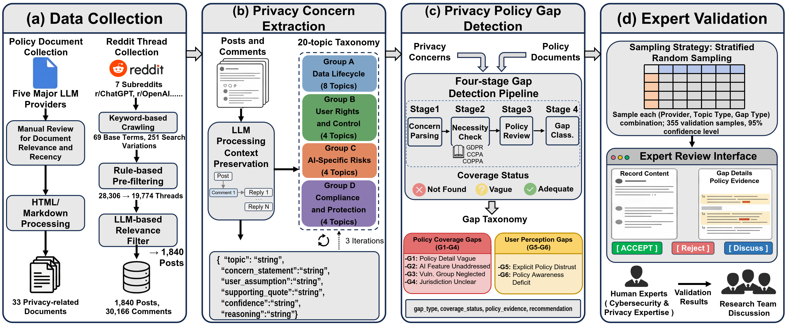

<p align="center">
  
</p>

# LLMPrivacyGap

**[USENIX Security 2026] What Users Ask, Policies Miss: Unveiling the Gap Between Community-Expressed Privacy Concerns and LLM Provider Policies**

<p align="center">
  
</p>

LLMPrivacyGap is a project for exploring privacy gaps between users' privacy concerns in LLM communities and the practical coverage of providers' privacy policies. It includes analysis scripts, prompts, developed taxonomies, configuration files, privacy-preserving demo data, ground-truth artifacts, expert-review outputs, and confusion-matrix reports.

> [!NOTE]
> This repository has been archived on Zenodo.
>
>
> DOI: `10.5281/zenodo.20310585`
>
>
> Permanent link: https://doi.org/10.5281/zenodo.20310585

> [!IMPORTANT]
> Raw user-generated Reddit content is not included in this public release. Demo source records and user-origin excerpts are anonymized, rewritten, or redacted for privacy protection.

## Navigation

| Section                                                      | What You Will Find                                                       |
| ------------------------------------------------------------ | ------------------------------------------------------------------------ |
| [Repository Map](#repository-map)                               | Current folder layout and where key files live.                          |
| [Quick Start](#quick-start)                                     | Minimal setup and commands for running the pipeline or demo app.         |
| [Pipeline Components](#pipeline-components)                     | Scripts for collection, concern extraction, gap auditing, and reporting. |
| [Taxonomy Tables](#taxonomy-tables)                             | Rendered privacy-topic and privacy-policy-gap taxonomy tables.           |
| [Anonymized Audit Demo](#anonymized-audit-demo)                 | How to run the Streamlit expert-review interface.                        |
| [Audit Interface Walkthrough](#audit-interface-walkthrough)     | Screenshot-guided explanation of the demo UI.                            |
| [Released Validation Artifacts](#released-validation-artifacts) | Ground-truth, post-hoc, and confusion-matrix outputs.                    |
| [Privacy Notes](#privacy-notes)                                 | How the public artifact avoids exposing raw user data.                   |

## Repository Map

```text
LLM-Privacy-Gap/
├── README.md
├── .gitignore
├── 01_Data_Collection/
│   ├── 00_Scripts/
│   │   ├── 02_reddit_relevance_filter.py
│   │   ├── prompts/
│   │   └── utils/
│   ├── 01_Init_SecurityPrivacyKeywords/
│   └── 02_Outputs/
│       └── Policies/
│           ├── privacy_policies/
│           └── supplemental_documents/
│
├── 02_ConcernExtraction_GapAnalysis/
│   ├── 00_Scripts/
│   │   ├── 00_data_preprocessor.py
│   │   ├── 01_concern_extractor.py
│   │   ├── 02_gap_auditor.py
│   │   ├── 03_gap_stats.py
│   │   ├── 04_result_mapper.py
│   │   ├── 05_gap_audit_app.py
│   │   ├── 06_generate_validation_sample.py
│   │   ├── run_pipeline.py
│   │   └── utils/
│   ├── 01_Prompts/
│   │   ├── concern_extraction.txt
│   │   └── gap_detection.txt
│   ├── 02_Outputs/
│   │   ├── ground-truth/
│   │   ├── confusion matrix/
│   │   └── double_coding_audit_anonymized/
│   ├── 03_Taxonomy of privacy topics (privacy concerns)/
│   ├── 04_Taxonomy of privacy policy gaps/
│   └── configs/
│       └── pipeline_config.yaml
│
└── assets/
```

## Quick Start

> [!NOTE]
> The repository does not currently include a pinned `requirements.txt`. The command below installs the common dependencies used by the scripts and the Streamlit demo.

```bash
python3 -m venv .venv
source .venv/bin/activate
pip install pandas tqdm pyyaml requests openai streamlit
```

Configure API and path settings in:

```text
02_ConcernExtraction_GapAnalysis/configs/pipeline_config.yaml
```

Run the full pipeline:

```bash
cd 02_ConcernExtraction_GapAnalysis/00_Scripts
python3 run_pipeline.py --all
```

Run the anonymized audit demo:

```bash
cd 02_ConcernExtraction_GapAnalysis
streamlit run 00_Scripts/05_gap_audit_app.py
```

> [!TIP]
> To use another port, run `streamlit run 00_Scripts/05_gap_audit_app.py --server.port 8502`.

## Pipeline Components

| Stage               | Script                               | Purpose                                                                    |
| ------------------- | ------------------------------------ | -------------------------------------------------------------------------- |
| Data preprocessing  | `00_data_preprocessor.py`          | Converts filtered Reddit threads into provider-specific analysis input.    |
| Concern extraction  | `01_concern_extractor.py`          | Extracts privacy concerns and assigns concern topics.                      |
| Gap auditing        | `02_gap_auditor.py`                | Compares concerns against provider privacy policies and assigns gap types. |
| Statistics          | `03_gap_stats.py`                  | Computes summary statistics from gap-analysis outputs.                     |
| Result mapping      | `04_result_mapper.py`              | Exports structured JSON/CSV/Markdown reports.                              |
| Audit demo          | `05_gap_audit_app.py`              | Provides the privacy-preserving Streamlit expert-review interface.         |
| Validation sampling | `06_generate_validation_sample.py` | Generates validation samples for expert review.                            |
| Orchestration       | `run_pipeline.py`                  | Runs selected phases or the full pipeline.                                 |

Common pipeline commands:

```bash
python3 run_pipeline.py --phase 0  # data preprocessing
python3 run_pipeline.py --phase 1  # concern extraction
python3 run_pipeline.py --phase 2  # gap auditing
python3 run_pipeline.py --phase 3  # result mapping
python3 run_pipeline.py --all      # full pipeline
```

Useful options:

```text
--provider      One of: chatgpt, claude, gemini, grok, deepseek
--test          Use limited test-mode input
--concurrent    Max concurrent API requests for LLM phases
--start         Start from a later phase when using --all
```

## Taxonomy Tables

### Privacy Topics

<figure>
  
  <figcaption>This table operationalizes the privacy concern taxonomy by providing formal definitions, classification criteria, and representative examples for each topic category. This structured specification ensures consistent interpretation of user-expressed concerns across annotators and supports reproducible categorization within the LLM-assisted extraction pipeline.</figcaption>
</figure>

### Privacy Policy Gaps

<figure>
  
  <figcaption>This table formalizes the privacy gap taxonomy by detailing classification rules, decision boundaries, and illustrative cases for each gap type. These specifications guide systematic gap identification and minimize ambiguity during automated and expert validation stages.</figcaption>
</figure>

## Anonymized Audit Demo

The public Streamlit app is:

```text
02_ConcernExtraction_GapAnalysis/00_Scripts/05_gap_audit_app.py
```

It uses the privacy-preserving demo workspace under:

```text
02_ConcernExtraction_GapAnalysis/02_Outputs/double_coding_audit_anonymized/
```

The demo supports:

- independent expert audit of sampled items;
- comparison between two completed expert audit runs;
- consensus adjudication for disagreement cases;
- result analysis against the LLM Pipeline;
- CSV/JSON export for downstream reporting;
- display of rewritten source records and rewritten user-origin excerpts.

> [!NOTE]
> Source records and user-origin excerpts in the demo are marked with `[Rewritten]` in the interface. Reddit IDs, user identifiers, and URLs are anonymized or redacted. Policy excerpts are preserved when they are policy text rather than user-generated content.

## Audit Interface Walkthrough

The screenshots below show the end-to-end expert-review workflow, from loading the anonymized demo sample to exporting final analysis results.

### 1. Demo Login and Setup


The opening page loads the demo dataset and initializes the audit session. This page is intended for the privacy-preserving demo sample rather than the raw full dataset.

### 2. Independent Audit View


The independent audit page places the rewritten source record and LLM Pipeline output on the left, and the expert judgment controls on the right. The left side includes anonymized record metadata, rewritten comments, concern topic, necessity information, and gap-topic information.

### 3. Audit Progress and Filtering


Experts can monitor completed and remaining items, filter by provider, and filter by audit status. This helps reviewers focus on unfinished items or inspect provider-specific subsets.

### 4. Policy Evidence and Necessity Analysis


The audit view exposes policy evidence, retrieved policy excerpts, and necessity/gap reasoning. These materials support expert decisions about whether the LLM Pipeline output is justified by the record and policy context.

### 5. Expert Comparison Analysis


The comparison page lets users select two completed expert audit files, compare judgments item by item, identify disagreements, and export the comparison table as CSV.

### 6. Consensus Adjudication


For records where two experts disagree, the team can discuss the case, adjust the decision, and save a final adjudicated outcome.

### 7. Final Adjudicated Output


After consensus adjudication, the interface summarizes the adjusted final results and supports exporting the final table as CSV.

### 8. Result Analysis Against the LLM Pipeline


The result-analysis page compares expert-reviewed outputs against the LLM Pipeline results and supports CSV export for reporting and follow-up analysis.

## Released Validation Artifacts

| Artifact Directory                                                                      | Purpose                                                                                                                |
| --------------------------------------------------------------------------------------- | ---------------------------------------------------------------------------------------------------------------------- |
| `01_Data_Collection/00_Scripts/prompts/`                                              | Prompts used as LLM instructions during data collection and filtering.                                                 |
| `01_Data_Collection/02_Outputs/Policies/`                                             | Collected provider policy datasets, including privacy policies and supplemental documents.                             |
| `02_ConcernExtraction_GapAnalysis/02_Outputs/ground-truth/`                           | Ground-truth JSON and CSV files for record-level, concern-level, and combined outputs.                                 |
| `02_ConcernExtraction_GapAnalysis/02_Outputs/confusion matrix/ground-truth_pipeline/` | Ground-truth vs. LLM Pipeline matrices for concern detection, gap detection, topic coverage, necessity, and gap types. |
| `02_ConcernExtraction_GapAnalysis/02_Outputs/confusion matrix/post-hoc/`              | Post-hoc expert-review matrices comparing Expert 1 and Expert 2.                                                       |
| `02_ConcernExtraction_GapAnalysis/02_Outputs/confusion matrix/Definitions.md`         | Definitions of TP/TN/FP/FN and notes for multi-label category matrices.                                                |
| `02_ConcernExtraction_GapAnalysis/02_Outputs/double_coding_audit_anonymized/`         | Demo input and expert-audit outputs for the Streamlit interface.                                                       |

> [!TIP]
> For category-level matrices such as `topic_coverage.csv` and `gap_types.csv`, precision/recall/F1 are computed from expanded category label events. See `confusion matrix/Definitions.md` for the exact convention.

## Privacy Notes

This public repository is designed to avoid exposing raw user-generated content.

- Raw Reddit posts and comments are not released.
- Demo source records are rewritten to prevent direct lookup of original posts.
- Reddit IDs, user identifiers, and URLs are anonymized or redacted.
- User-origin excerpts are rewritten and marked in the interface.
- Policy excerpts are preserved when they are policy text rather than user-generated content.

> [!CAUTION]
> If you add new demo data, review source records, user quotes, URLs, identifiers, and generated explanations before publishing them.
